 

---

## 👋 About Me

I'm a **Software Engineer** focused on **Android Development, Kotlin, and Software Architecture**.

I enjoy building maintainable software and exploring how architectural decisions affect software evolution, quality, and maintainability.

- 📱 Android Development with Kotlin
- 🏗️ Software Architecture and Architectural Patterns
- 🔬 MSc Researcher in Software Architecture
- 🌱 Exploring Kotlin Multiplatform and Compose Multiplatform
- 💻 Experience with Kotlin, Java, and C++

---

## 🛠️ Tech Stack

### Android

  

**Kotlin · Android SDK · Jetpack Compose · ViewModel · Coroutines · Flow · Room · SQLite · DataStore · Navigation Component**

### Architecture

**MVVM · MVI · Clean Architecture · Modularization · Separation of Concerns · Software Architecture · Architectural Patterns · Unit Testing**

### Kotlin Multiplatform

**Kotlin Multiplatform · Compose Multiplatform · Shared Architecture · Platform-specific Implementations**

### Other Technologies

  

---

## 🔬 Research

### From Code to Architecture

**From Code to Architecture: Responsibility Analysis and Dependency Graphs in the Inference of Architectural Patterns in Kotlin**

Research on the inference of architectural patterns from Kotlin repositories using:

- Responsibility analysis
- Dependency graphs
- Class role identification
- Structural and semantic evidence
- Architectural pattern inference

**SBES 2026 · Research Track**

The paper was **accepted and presented at SBES 2026**.

---

## 🚀 Featured Projects

### 🏗️ Architectural Pattern Inference

Research project focused on identifying architectural patterns in Kotlin repositories through source-code analysis.

**Focus**

`Kotlin` · `Software Architecture` · `Dependency Graphs` · `Pattern Inference`

---

### 📱 Kotlin Multiplatform Architecture

Exploration of software architecture for applications built with Kotlin Multiplatform and Compose Multiplatform.

**Focus**

`Kotlin Multiplatform` · `Compose Multiplatform` · `Architecture` · `Modularization`

---

### 📊 Research Artifacts

Supporting artifacts for software architecture research, including repository analysis, architectural ground truth, inference results, and datasets.

**Focus**

`Python` · `Kotlin` · `Data Analysis` · `Software Architecture`

---

## 📊 GitHub Stats

---

## 📈 GitHub Metrics

---

## 🎯 Current Interests

- Android Development with Kotlin
- Jetpack Compose
- Modern Android Architecture
- Kotlin Multiplatform
- Compose Multiplatform
- Software Architecture
- Architectural Evolution
- Architectural Pattern Inference
- Software Quality and Maintainability

---

<i>Building software. Exploring architecture. Learning continuously.</i>

